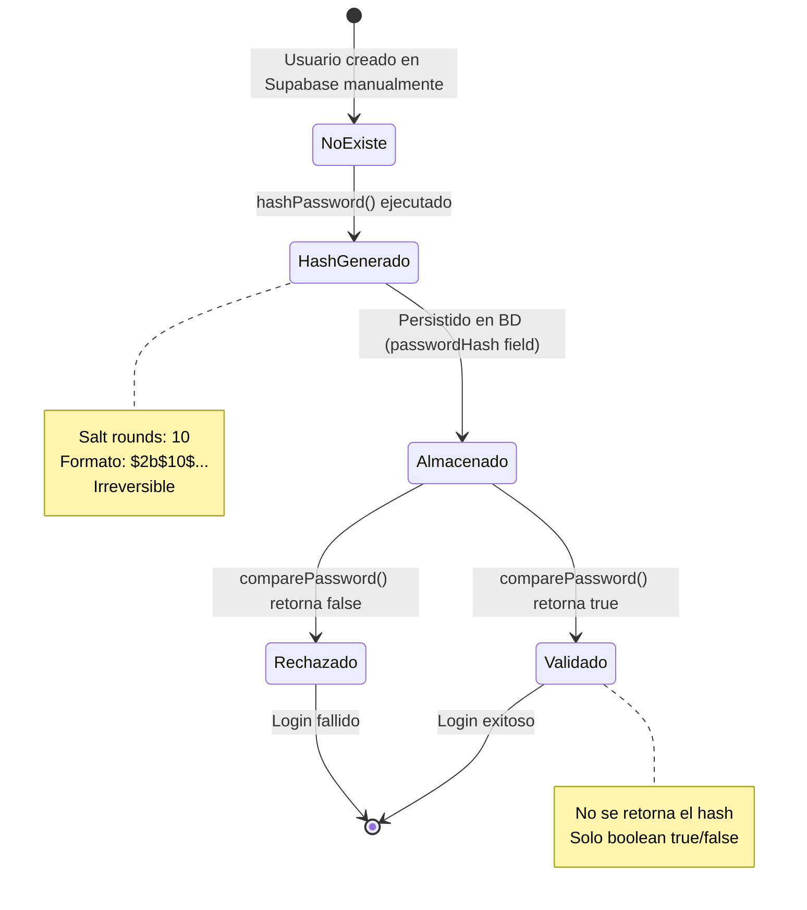

# One Spec (Root Spec)
# FASE 3: Módulo de Contraseñas - Sistema de Hash Seguro

---

## Objetivo

Implementar un módulo seguro de gestión de contraseñas que permita el hashing y verificación de contraseñas utilizando bcrypt, siguiendo los principios de arquitectura hexagonal y garantizando la seguridad de las credenciales de usuarios en el microservicio de autenticación Loggin-MCP.

**Meta Específica:**
Crear una capa de utilidades independiente (`src/utils/password.ts`) que encapsule toda la lógica de hashing y comparación de contraseñas, permitiendo su reutilización en diferentes capas de la arquitectura (Application y Infrastructure) sin acoplar la lógica de negocio a detalles de implementación específicos.

---

## Alcance / No alcance

### ✅ DENTRO DEL ALCANCE (Lo que SÍ haremos)

1. **Instalación de dependencias:**
   - Instalar `bcrypt` versión ^5.1.1
   - Instalar `@types/bcrypt` versión ^5.0.2 como dependencia de desarrollo

2. **Creación de estructura:**
   - Crear carpeta `src/utils/` si no existe
   - Crear archivo `src/utils/password.ts`

3. **Implementación de funciones core:**
   - `hashPassword(password: string): Promise<string>`  
     → Genera hash seguro de contraseña con salt rounds = 10
   - `comparePassword(password: string, hash: string): Promise<boolean>`  
     → Verifica si una contraseña coincide con su hash

4. **Validaciones básicas:**
   - Validar que la contraseña no esté vacía antes de hashear
   - Validar que los parámetros no sean nulos/undefined
   - Manejo de errores con try-catch y mensajes descriptivos

5. **Documentación:**
   - JSDoc completo para cada función explicando parámetros, retornos y errores
   - Comentarios sobre consideraciones de seguridad
   - Ejemplos de uso en comentarios

6. **Testing manual:**
   - Crear script de prueba `test-password.ts` para validar funcionalidad
   - Verificar que el hash generado es diferente cada vez (por el salt)
   - Verificar que comparePassword funciona correctamente

### ❌ FUERA DEL ALCANCE (Lo que NO haremos en esta fase)

1. **NO se implementará:**
   - Lógica de políticas de contraseñas (longitud mínima, complejidad, etc.) → Fase 8
   - Integración con controladores HTTP → Fase 5 y 6
   - Implementación de servicios de autenticación → Fase 5
   - Sistema de recuperación de contraseñas → Fase 10
   - Almacenamiento en base de datos → Ya existe en UserRepositoryPort
   - Rate limiting para intentos de validación → Futuro
   - Rotación de secrets o peper adicionales → Futuro
   - Testing automatizado con Jest/Mocha → Fase 9

2. **NO se modificará:**
   - Entidades de dominio (`User.ts`)
   - Puertos e interfaces existentes
   - Configuración de Supabase
   - Rutas o controladores existentes

---

## Definiciones (lenguaje de dominio)

### Conceptos Clave

| Término | Definición | Contexto en el Sistema |
|---------|-----------|------------------------|
| **Password (Contraseña)** | Credencial secreta en texto plano proporcionada por el usuario para autenticación. | Nunca se almacena en texto plano. Se recibe en endpoints y se procesa inmediatamente. |
| **Hash** | Resultado de aplicar función criptográfica unidireccional a una contraseña. Es irreversible. | Se almacena en campo `passwordHash` de la entidad User. |
| **Salt** | Valor aleatorio único agregado a cada contraseña antes de hashearla para prevenir ataques con rainbow tables. | Generado automáticamente por bcrypt, incluido en el hash resultante. |
| **Salt Rounds** | Número de iteraciones del algoritmo de hashing. Mayor rounds = más seguro pero más lento. | Valor configurado: 10 (estándar recomendado en 2026). |
| **Bcrypt** | Algoritmo de hashing adaptativo basado en Blowfish, diseñado para ser lento y resistente a fuerza bruta. | Librería principal para hashing de contraseñas en este proyecto. |
| **Password Hash Matching** | Proceso de verificar si una contraseña en texto plano corresponde a un hash almacenado. | Usado en proceso de login para validar credenciales. |

### Flujos del Sistema

**Flujo 1: Creación de Contraseña (Primera vez)**
```
Usuario ingresa contraseña → hashPassword() → Hash generado → 
Almacenar en BD (campo passwordHash) → Actualizar hasPassword = true
```

**Flujo 2: Validación de Contraseña (Login)**
```
Usuario ingresa contraseña → Recuperar hash de BD → 
comparePassword(passwordIngresada, hashAlmacenado) → 
Boolean (true = credenciales válidas, false = inválidas)
```

---

## Principios / Reglas no negociables

### 🔒 Seguridad

1. **NUNCA almacenar contraseñas en texto plano**
   - Toda contraseña debe pasar por `hashPassword()` antes de persistir
   - No loguear contraseñas en consola ni archivos
   - No incluir contraseñas en respuestas HTTP

2. **Salt único por contraseña**
   - Bcrypt genera salt automáticamente
   - No reutilizar salts entre diferentes contraseñas
   - Salt embebido en el hash (formato: `$2b$10$...`)

3. **Uso de algoritmo moderno**
   - Bcrypt es el estándar actual (2026)
   - No usar MD5, SHA1 o algoritmos deprecados
   - Mantener bcrypt actualizado para patches de seguridad

4. **Resistencia a timing attacks**
   - Bcrypt inherentemente resistente por diseño
   - No implementar comparaciones naive de strings
   - Usar siempre `bcrypt.compare()` para verificación

### 🏗️ Arquitectura

5. **Independencia de frameworks**
   - `password.ts` debe ser una utilidad pura
   - No depender de Express, Supabase u otros frameworks
   - Solo depender de bcrypt y tipos nativos de TypeScript

6. **Reusabilidad**
   - Funciones exportadas deben ser stateless
   - No mantener estado interno en el módulo
   - Facilitar testing unitario

7. **Manejo de errores explícito**
   - Propagar errores con mensajes claros
   - No silenciar excepciones de bcrypt
   - Retornar promesas rechazadas en caso de fallo

### 📏 Código

8. **TypeScript estricto**
   - Todas las funciones con tipos explícitos
   - No usar `any`
   - Aprovechar `strict: true` del tsconfig.json

9. **Programación asíncrona**
   - Bcrypt es CPU-intensive, usar versiones async
   - Retornar Promises en todas las funciones
   - No usar versiones síncronas (bcryptSync)

10. **Documentación obligatoria**
    - JSDoc en todas las funciones públicas
    - Explicar parámetros y valores de retorno
    - Incluir ejemplos de uso

---

## Límites

### Límites Técnicos

| Límite | Valor | Justificación |
|--------|-------|---------------|
| **Salt Rounds** | 10 | Balance entre seguridad y performance. En hardware de 2026, ~100ms por hash. |
| **Longitud mínima password** | N/A en esta fase | Se validará en Fase 8 (Validaciones). Bcrypt acepta hasta 72 bytes. |
| **Encoding** | UTF-8 | Estándar web universal. Bcrypt trunca a 72 bytes internamente. |
| **Tiempo máximo de hash** | ~150ms | En hardware promedio. Más de 200ms puede indicar problema. |

### Límites de Responsabilidad

**Este módulo ES responsable de:**
- Generar hashes seguros de contraseñas
- Verificar si una contraseña coincide con un hash
- Validaciones básicas de inputs (no nulos, no vacíos)
- Manejo de errores de bcrypt

**Este módulo NO es responsable de:**
- Validar complejidad de contraseñas (mayúsculas, números, etc.)
- Almacenar contraseñas en base de datos
- Implementar lógica de recuperación de contraseñas
- Rate limiting o prevención de fuerza bruta
- Autenticación JWT (Fase 4)
- Gestión de sesiones

### Límites de Performance

- **Máximo 10 hashes simultáneos:** Bcrypt es CPU-bound. Para más carga, considerar queue.
- **Un hash por request:** No hashear múltiples contraseñas en una sola operación HTTP.
- **No cachear hashes:** Cada hash debe ser generado fresh con salt único.

---

## Eventos y estados (visión raíz)

### Estados de una Contraseña en el Sistema



### Eventos Relacionados con Password Utils

| Evento | Entrada | Salida | Efecto Secundario |
|--------|---------|--------|-------------------|
| **hashPassword()** | `password: string` | `Promise<string>` (hash) | CPU intensivo (~100ms) |
| **comparePassword()** | `password: string, hash: string` | `Promise<boolean>` | Lectura de hash, comparación |
| **Error: Empty Password** | `password: ""` | `throw Error` | Log de error |
| **Error: Null Input** | `password: null` | `throw Error` | Log de error |
| **Error: Bcrypt Failure** | Password inválido | `throw Error` | Propagación de error de bcrypt |

### Interacción con Otras Capas

```
┌─────────────────────────────────────────────────────────┐
│  INFRASTRUCTURE LAYER (Controllers)                      │
│  - Recibe password en texto plano desde HTTP request    │
└──────────────────┬──────────────────────────────────────┘
                   │
                   ▼
┌─────────────────────────────────────────────────────────┐
│  APPLICATION LAYER (Use Cases / Services)                │
│  - Orquesta lógica de negocio                           │
│  - Llama a UserRepository para operaciones BD           │
└──────────────────┬──────────────────────────────────────┘
                   │
                   ▼
┌─────────────────────────────────────────────────────────┐
│  UTILS LAYER (password.ts) ← IMPLEMENTACIÓN FASE 3      │
│  ┌───────────────────────────────────────────────────┐  │
│  │ hashPassword(password)                            │  │
│  │   → Genera hash bcrypt con salt rounds 10        │  │
│  │                                                   │  │
│  │ comparePassword(password, hash)                   │  │
│  │   → Verifica match entre password y hash         │  │
│  └───────────────────────────────────────────────────┘  │
└──────────────────┬──────────────────────────────────────┘
                   │
                   ▼
┌─────────────────────────────────────────────────────────┐
│  DOMAIN LAYER (Entities & Ports)                         │
│  - User.passwordHash (almacena el hash)                 │
│  - User.hasPassword (flag booleano)                     │
└─────────────────────────────────────────────────────────┘
```

---

## Criterios de aceptación (root)

### ✅ Criterio 1: Dependencias Instaladas

**DADO** que el proyecto Loggin-MCP está inicializado con npm  
**CUANDO** se ejecuta `npm install`  
**ENTONCES:**
- ✅ `bcrypt` versión ^5.1.1 está en `dependencies` del package.json
- ✅ `@types/bcrypt` versión ^5.0.2 está en `devDependencies`
- ✅ No hay errores de instalación ni vulnerabilidades críticas
- ✅ `node_modules/bcrypt/` contiene binarios nativos compilados correctamente

**Validación:**
```bash
npm list bcrypt
npm list @types/bcrypt
```

---

### ✅ Criterio 2: Estructura de Archivos

**DADO** que las dependencias están instaladas  
**CUANDO** se revisa la estructura del proyecto  
**ENTONCES:**
- ✅ Existe carpeta `src/utils/`
- ✅ Existe archivo `src/utils/password.ts`
- ✅ El archivo tiene permisos de lectura/escritura
- ✅ El archivo está bajo control de versiones Git

**Estructura esperada:**
```
src/
├── utils/
│   └── password.ts  ← NUEVO ARCHIVO
├── domain/
├── application/
└── infrastructure/
```

---

### ✅ Criterio 3: Función hashPassword() Implementada

**DADO** que `src/utils/password.ts` existe  
**CUANDO** se importa y ejecuta `hashPassword()`  
**ENTONCES:**

**3.1. Firma de función correcta:**
```typescript
export async function hashPassword(password: string): Promise<string>
```

**3.2. Comportamiento con input válido:**
```typescript
const hash = await hashPassword("MiContraseña123!");
// ✅ hash empieza con "$2b$10$" (formato bcrypt)
// ✅ hash tiene longitud ~60 caracteres
// ✅ hash es diferente cada vez que se ejecuta (por salt aleatorio)
```

**3.3. Validaciones de input:**
```typescript
// ✅ Lanza error si password es string vacío
await hashPassword("") // → throw Error("Password cannot be empty")

// ✅ Lanza error si password es null/undefined
await hashPassword(null!) // → throw Error
```

**3.4. Documentación JSDoc presente:**
```typescript
/**
 * Genera un hash seguro de una contraseña usando bcrypt.
 * 
 * @param password - Contraseña en texto plano a hashear
 * @returns Promise que resuelve al hash de la contraseña
 * @throws {Error} Si password está vacío o es inválido
 * 
 * @example
 * const hash = await hashPassword("MiPassword123!");
 * // hash = "$2b$10$N9qo8uLO..."
 */
```

**3.5. Performance:**
- ✅ Completar en menos de 200ms en hardware promedio de 2026
- ✅ Salt rounds configurado en 10

---

### ✅ Criterio 4: Función comparePassword() Implementada

**DADO** que `src/utils/password.ts` existe  
**CUANDO** se importa y ejecuta `comparePassword()`  
**ENTONCES:**

**4.1. Firma de función correcta:**
```typescript
export async function comparePassword(
  password: string, 
  hash: string
): Promise<boolean>
```

**4.2. Comportamiento con password correcta:**
```typescript
const hash = await hashPassword("Password123!");
const isValid = await comparePassword("Password123!", hash);
// ✅ isValid === true
```

**4.3. Comportamiento con password incorrecta:**
```typescript
const hash = await hashPassword("Password123!");
const isValid = await comparePassword("WrongPassword", hash);
// ✅ isValid === false
```

**4.4. Case sensitivity:**
```typescript
const hash = await hashPassword("Password123!");
const isValid = await comparePassword("password123!", hash);
// ✅ isValid === false (distingue mayúsculas/minúsculas)
```

**4.5. Validaciones de input:**
```typescript
// ✅ Lanza error si password vacío
await comparePassword("", hash) // → throw Error

// ✅ Lanza error si hash inválido
await comparePassword("pass", "invalid-hash") // → throw Error
```

**4.6. Documentación JSDoc presente:**
```typescript
/**
 * Compara una contraseña en texto plano con su hash bcrypt.
 * 
 * @param password - Contraseña en texto plano a verificar
 * @param hash - Hash bcrypt almacenado previamente
 * @returns Promise que resuelve a true si coinciden, false si no
 * @throws {Error} Si los parámetros son inválidos
 * 
 * @example
 * const isValid = await comparePassword("userInput", storedHash);
 * if (isValid) {
 *   // Login exitoso
 * }
 */
```

---

### ✅ Criterio 5: Testing Manual Exitoso

**DADO** que ambas funciones están implementadas  
**CUANDO** se crea y ejecuta script de prueba `test-password.ts`  
**ENTONCES:**

**5.1. Script de prueba creado:**
```typescript
// test-password.ts en raíz del proyecto
import { hashPassword, comparePassword } from './src/utils/password';

async function testPasswordModule() {
  console.log('🧪 Testing Password Module...\n');

  // Test 1: Hash generation
  console.log('Test 1: Generating hash...');
  const password = 'TestPassword123!';
  const hash1 = await hashPassword(password);
  const hash2 = await hashPassword(password);
  console.log('Hash 1:', hash1);
  console.log('Hash 2:', hash2);
  console.log('✅ Hashes are different (salt is unique):', hash1 !== hash2);

  // Test 2: Correct password validation
  console.log('\nTest 2: Valid password comparison...');
  const isValid = await comparePassword(password, hash1);
  console.log('✅ Password matches:', isValid === true);

  // Test 3: Incorrect password validation
  console.log('\nTest 3: Invalid password comparison...');
  const isInvalid = await comparePassword('WrongPassword', hash1);
  console.log('✅ Wrong password rejected:', isInvalid === false);

  // Test 4: Empty password handling
  console.log('\nTest 4: Empty password validation...');
  try {
    await hashPassword('');
    console.log('❌ Should have thrown error');
  } catch (error) {
    console.log('✅ Error thrown for empty password');
  }

  console.log('\n✅ All tests passed!');
}

testPasswordModule().catch(console.error);
```

**5.2. Ejecución del test:**
```bash
npx ts-node test-password.ts
```

**5.3. Output esperado:**
```
🧪 Testing Password Module...

Test 1: Generating hash...
Hash 1: $2b$10$abcdefghijklmnopqrstuv...
Hash 2: $2b$10$zyxwvutsrqponmlkjihgfe...
✅ Hashes are different (salt is unique): true

Test 2: Valid password comparison...
✅ Password matches: true

Test 3: Invalid password comparison...
✅ Wrong password rejected: true

Test 4: Empty password validation...
✅ Error thrown for empty password

✅ All tests passed!
```

---

### ✅ Criterio 6: Código Cumple Estándares

**DADO** que el código está implementado  
**CUANDO** se revisa el código  
**ENTONCES:**

**6.1. TypeScript sin errores:**
```bash
npx tsc --noEmit
# ✅ Sin errores de compilación
```

**6.2. Cumple con TSConfig strict mode:**
- ✅ No hay tipos `any`
- ✅ Todos los parámetros tipados
- ✅ Retornos explícitos
- ✅ Null checks apropiados

**6.3. Formato y estilo:**
- ✅ Indentación consistente (2 espacios)
- ✅ Nombres descriptivos (`hashPassword`, no `hp`)
- ✅ Camel case para funciones
- ✅ Comentarios claros y concisos

**6.4. Imports correctos:**
```typescript
import * as bcrypt from 'bcrypt';
// o
import bcrypt from 'bcrypt';
```

**6.5. No hay código comentado innecesario**

**6.6. No hay console.log en código de producción** (solo en test)

---

### ✅ Criterio 7: Seguridad Validada

**DADO** que el módulo está implementado  
**CUANDO** se revisa la implementación desde perspectiva de seguridad  
**ENTONCES:**

**7.1. Salt rounds adecuado:**
```typescript
const SALT_ROUNDS = 10; // ✅ Valor recomendado
```

**7.2. No se exponen contraseñas:**
- ✅ No hay console.log con contraseñas
- ✅ Errores no incluyen contraseñas en mensajes
- ✅ Funciones no retornan contraseñas originales

**7.3. Uso correcto de bcrypt:**
- ✅ Se usa `bcrypt.hash()` no manualmente salt + hash
- ✅ Se usa `bcrypt.compare()` para validación
- ✅ Se usan versiones asíncronas (no síncronas)

**7.4. Manejo de errores seguro:**
```typescript
// ✅ No revelar si el hash es inválido vs password incorrecta
// En ambos casos retornar false o error genérico
```

**7.5. Resistencia a timing attacks:**
- ✅ Bcrypt inherentemente resistente
- ✅ No se implementan comparaciones custom

---

### ✅ Criterio 8: Documentación Completa

**DADO** que el módulo está implementado  
**CUANDO** se revisa la documentación  
**ENTONCES:**

**8.1. JSDoc en todas las funciones exportadas:**
- ✅ Descripción de la función
- ✅ @param para cada parámetro  
- ✅ @returns explicando qué retorna
- ✅ @throws para errores posibles
- ✅ @example con uso práctico

**8.2. Comentarios inline donde sea necesario:**
```typescript
// Bcrypt genera salt automáticamente con genSalt incluido en hash()
const hash = await bcrypt.hash(password, SALT_ROUNDS);
```

**8.3. README.md actualizado** (opcional en esta fase, pero recomendado):
```markdown
## 🔒 Password Module (Fase 3)

Módulo de utilidades para hashing y validación de contraseñas usando bcrypt.

### Funciones

- `hashPassword(password: string): Promise<string>`
- `comparePassword(password: string, hash: string): Promise<boolean>`

### Ejemplo de uso

\`\`\`typescript
import { hashPassword, comparePassword } from './utils/password';

// Al crear contraseña
const hash = await hashPassword(userInput);
await userRepository.updatePassword(userId, hash);

// Al hacer login
const storedHash = user.passwordHash;
const isValid = await comparePassword(userInput, storedHash);
\`\`\`
```

---

## Trazabilidad

### Relación con Plan de Desarrollo

| Tarea en PLAN_DESARROLLO.md | Estado | Cubierto en ONE_SPEC |
|------------------------------|--------|----------------------|
| **Fase 3: Módulo de Contraseñas** | ✅ Especificado | Este documento |
| Tarea 3.1: Configurar bcrypt para hash | ✅ Especificado | Criterios 1, 2 |
| - Instalar bcrypt y @types/bcrypt | ✅ Especificado | Criterio 1 |
| - Crear utilidad src/utils/password.ts | ✅ Especificado | Criterio 2 |
| - Implementar hashPassword() | ✅ Especificado | Criterio 3 |
| - Implementar comparePassword() | ✅ Especificado | Criterio 4 |

### Dependencias con Otras Fases

| Fase | Relación | Tipo de Dependencia |
|------|----------|---------------------|
| **Fase 1** ✅ | Configuración base de TypeScript y estructura | COMPLETADA (Prerrequisito) |
| **Fase 2** ✅ | Supabase configurado para almacenar hashes | COMPLETADA (Prerrequisito) |
| **Fase 4** ⏳ | JWT usará `comparePassword` para validar login | BLOQUEADA por Fase 3 |
| **Fase 5** ⏳ | Servicios de auth usarán ambas funciones | BLOQUEADA por Fase 3 |
| **Fase 6** ⏳ | Controladores invocarán servicios que usan password utils | BLOQUEADA por Fase 5 |
| **Fase 8** ⏳ | Validaciones de complejidad de password se integrarán | INDEPENDIENTE (puede extender) |

### Archivos Afectados

| Archivo | Tipo de Cambio | Descripción |
|---------|----------------|-------------|
| `package.json` | MODIFICACIÓN | Agregar bcrypt y @types/bcrypt a dependencies |
| `package-lock.json` | MODIFICACIÓN | Actualizado automáticamente por npm install |
| `src/utils/` | CREACIÓN (CARPETA) | Nueva carpeta para utilidades |
| `src/utils/password.ts` | CREACIÓN (ARCHIVO) | Implementación de hashPassword y comparePassword |
| `test-password.ts` | CREACIÓN (ARCHIVO) | Script de testing manual temporal |
| `README.md` | MODIFICACIÓN (OPCIONAL) | Documentar nuevo módulo |

### Puntos de Integración Futuros

**Fase 5 - Servicios de Autenticación:**
```typescript
// src/application/usecase/CreatePasswordUseCase.ts (FUTURO)
import { hashPassword } from '../../utils/password';

async execute(email: string, password: string) {
  const user = await this.userRepository.findByEmail(email);
  if (user.hasPassword) throw new Error('Password already exists');
  
  const hash = await hashPassword(password); // ← USO DEL MÓDULO
  await this.userRepository.updatePassword(user.id, hash);
}
```

**Fase 5 - Login:**
```typescript
// src/application/usecase/LoginUseCase.ts (FUTURO)
import { comparePassword } from '../../utils/password';

async execute(email: string, password: string) {
  const user = await this.userRepository.findByEmail(email);
  if (!user.hasPassword) throw new Error('No password set');
  
  const isValid = await comparePassword(password, user.passwordHash!); // ← USO
  if (!isValid) throw new UnauthorizedError('Invalid credentials');
  
  return generateToken(user.id, user.email); // Fase 4
}
```

### Conformidad con Arquitectura Hexagonal

```
┌───────────────────────────────────────────────────────────────┐
│  CAPA UTILS (Independiente de capas)                          │
│  ┌─────────────────────────────────────────────────────────┐  │
│  │ password.ts ← FASE 3 IMPLEMENTA AQUÍ                    │  │
│  │   - hashPassword()                                      │  │
│  │   - comparePassword()                                   │  │
│  │                                                         │  │
│  │ ✅ Sin dependencias de Domain, App o Infrastructure     │  │
│  │ ✅ Solo depende de bcrypt (librería externa)           │  │
│  │ ✅ Reusable en cualquier capa                          │  │
│  └─────────────────────────────────────────────────────────┘  │
└───────────────────────────────────────────────────────────────┘
             ▲                            ▲
             │                            │
    ┌────────┴────────┐         ┌────────┴─────────┐
    │  APPLICATION    │         │  INFRASTRUCTURE  │
    │  (Fase 5)       │         │  (Fase 6)        │
    │  Use Cases      │         │  Controllers     │
    └─────────────────┘         └──────────────────┘
```

**Ventajas de esta ubicación:**
- ✅ No acopla lógica de negocio a detalles de hashing
- ✅ Fácil de testear unitariamente
- ✅ Puede ser reemplazada por otra implementación (e.g., Argon2) sin afectar otras capas
- ✅ Respeta principios SOLID (Single Responsibility, Dependency Inversion)

---

## 📋 Checklist de Implementación (Orden Sugerido)

### Paso 1: Instalación de Dependencias
```bash
cd C:\Users\Usuario\Documents\mcp-server\Loggin-Mcp
npm install bcrypt@^5.1.1
npm install --save-dev @types/bcrypt@^5.0.2
```
**Validar:** `npm list bcrypt` y `npm list @types/bcrypt`

---

### Paso 2: Crear Estructura de Carpetas
```bash
mkdir src\utils
```
**Validar:** Carpeta `src/utils/` existe

---

### Paso 3: Crear Archivo password.ts

**Ruta:** `src/utils/password.ts`

**Contenido completo:**

```typescript
/**
 * Password Utility Module
 * 
 * Proporciona funciones para hashing seguro y validación de contraseñas
 * usando bcrypt. Este módulo es independiente de capas y puede ser usado
 * en Application Layer (Use Cases) e Infrastructure Layer (Controllers).
 * 
 * @module utils/password
 */

import * as bcrypt from 'bcrypt';

/**
 * Número de rondas de salt para bcrypt.
 * Valor recomendado en 2026: 10
 * Mayor valor = más seguro pero más lento.
 * 
 * Performance aproximada con 10 rounds: ~100-150ms
 */
const SALT_ROUNDS = 10;

/**
 * Genera un hash seguro de una contraseña usando bcrypt.
 * 
 * El hash generado incluye el salt de forma automática y es único
 * para cada ejecución, incluso con la misma contraseña de entrada.
 * Esto previene ataques con rainbow tables.
 * 
 * @param password - Contraseña en texto plano a hashear (máximo 72 bytes UTF-8)
 * @returns Promise que resuelve al hash bcrypt de la contraseña (formato: $2b$10$...)
 * @throws {Error} Si la contraseña está vacía o es inválida
 * @throws {Error} Si bcrypt falla internamente
 * 
 * @example
 * ```typescript
 * const hash = await hashPassword("MiPassword123!");
 * // hash = "$2b$10$N9qo8uLOValidHash..."
 * 
 * // Cada ejecución produce hash diferente:
 * const hash1 = await hashPassword("same");
 * const hash2 = await hashPassword("same");
 * // hash1 !== hash2 (debido al salt único)
 * ```
 * 
 * @security
 * - NO loguear la contraseña en texto plano
 * - NO almacenar la contraseña original
 * - Bcrypt trunca automáticamente a 72 bytes
 */
export async function hashPassword(password: string): Promise<string> {
  // Validación: password no debe estar vacío
  if (!password || password.trim().length === 0) {
    throw new Error('Password cannot be empty');
  }

  try {
    // bcrypt.hash() genera el salt automáticamente y lo incluye en el hash
    // No es necesario llamar a genSalt() manualmente
    const hash = await bcrypt.hash(password, SALT_ROUNDS);
    return hash;
  } catch (error) {
    // Propagar error con contexto adicional
    throw new Error(`Failed to hash password: ${(error as Error).message}`);
  }
}

/**
 * Compara una contraseña en texto plano con su hash bcrypt almacenado.
 * 
 * Esta función es resistente a timing attacks gracias a la implementación
 * interna de bcrypt. Nunca implementar comparación manual de strings.
 * 
 * @param password - Contraseña en texto plano a verificar
 * @param hash - Hash bcrypt almacenado previamente (formato: $2b$10$...)
 * @returns Promise que resuelve a:
 *          - `true` si la contraseña coincide con el hash
 *          - `false` si la contraseña NO coincide o el hash es inválido
 * @throws {Error} Si los parámetros son nulos, undefined o vacíos
 * @throws {Error} Si bcrypt falla internamente
 * 
 * @example
 * ```typescript
 * // En proceso de login:
 * const storedHash = user.passwordHash;
 * const userInput = "password123";
 * 
 * const isValid = await comparePassword(userInput, storedHash);
 * 
 * if (isValid) {
 *   console.log("Login exitoso");
 *   // Generar JWT token...
 * } else {
 *   console.log("Credenciales inválidas");
 *   // Retornar 401 Unauthorized
 * }
 * ```
 * 
 * @security
 * - La comparación es case-sensitive
 * - No revelar en errores si el hash es inválido vs password incorrecta
 * - Tiempo de ejecución constante para prevenir timing attacks
 */
export async function comparePassword(
  password: string,
  hash: string
): Promise<boolean> {
  // Validación: ambos parámetros deben existir
  if (!password || password.trim().length === 0) {
    throw new Error('Password cannot be empty');
  }

  if (!hash || hash.trim().length === 0) {
    throw new Error('Hash cannot be empty');
  }

  try {
    // bcrypt.compare() maneja internamente la extracción del salt del hash
    // y realiza la comparación de forma segura
    const isMatch = await bcrypt.compare(password, hash);
    return isMatch;
  } catch (error) {
    // Si el hash es inválido, bcrypt lanzará error
    // Por seguridad, no revelar detalles específicos del error
    throw new Error(`Failed to compare password: ${(error as Error).message}`);
  }
}

/**
 * Obtiene el número de salt rounds configurado.
 * 
 * Útil para debugging o logging de configuración.
 * 
 * @returns Número de rondas de salt (10 por defecto)
 * 
 * @example
 * ```typescript
 * console.log(`Salt rounds configuradas: ${getSaltRounds()}`);
 * // Output: Salt rounds configuradas: 10
 * ```
 */
export function getSaltRounds(): number {
  return SALT_ROUNDS;
}
```

**Validar:**
- ✅ Archivo creado en `src/utils/password.ts`
- ✅ Sin errores de TypeScript: `npx tsc --noEmit`

---

### Paso 4: Crear Script de Testing

**Ruta:** `test-password.ts` (en raíz del proyecto)

**Contenido completo:**

```typescript
/**
 * Script de Testing Manual - Password Module
 * 
 * Este script valida la funcionalidad básica del módulo de contraseñas.
 * En Fase 9 se reemplazará por tests automatizados con Jest.
 * 
 * Uso: npx ts-node test-password.ts
 */

import { hashPassword, comparePassword, getSaltRounds } from './src/utils/password';

async function testPasswordModule() {
  console.log('🔒 ===============================================');
  console.log('🧪 Testing Password Module - Fase 3');
  console.log('🔒 ===============================================\n');

  let testsPassed = 0;
  let testsFailed = 0;

  // Test 1: Configuración
  console.log('📋 Test 1: Verificar configuración');
  try {
    const saltRounds = getSaltRounds();
    console.log(`   Salt rounds: ${saltRounds}`);
    if (saltRounds === 10) {
      console.log('   ✅ PASS: Salt rounds correctamente configurado en 10\n');
      testsPassed++;
    } else {
      console.log('   ❌ FAIL: Salt rounds debería ser 10\n');
      testsFailed++;
    }
  } catch (error) {
    console.log(`   ❌ FAIL: ${error}\n`);
    testsFailed++;
  }

  // Test 2: Hash generation
  console.log('📋 Test 2: Generar hash de contraseña');
  try {
    const password = 'TestPassword123!';
    const hash1 = await hashPassword(password);
    const hash2 = await hashPassword(password);
    
    console.log(`   Password: "${password}"`);
    console.log(`   Hash 1: ${hash1}`);
    console.log(`   Hash 2: ${hash2}`);
    
    if (hash1.startsWith('$2b$10$') && hash2.startsWith('$2b$10$') && hash1 !== hash2) {
      console.log('   ✅ PASS: Hashes generados correctamente y son únicos\n');
      testsPassed++;
    } else {
      console.log('   ❌ FAIL: Hashes inválidos o no únicos\n');
      testsFailed++;
    }
  } catch (error) {
    console.log(`   ❌ FAIL: ${error}\n`);
    testsFailed++;
  }

  // Test 3: Correct password validation
  console.log('📋 Test 3: Validar contraseña correcta');
  try {
    const password = 'CorrectPassword456!';
    const hash = await hashPassword(password);
    const isValid = await comparePassword(password, hash);
    
    console.log(`   Password: "${password}"`);
    console.log(`   Match result: ${isValid}`);
    
    if (isValid === true) {
      console.log('   ✅ PASS: Contraseña correcta validada exitosamente\n');
      testsPassed++;
    } else {
      console.log('   ❌ FAIL: Contraseña correcta no fue reconocida\n');
      testsFailed++;
    }
  } catch (error) {
    console.log(`   ❌ FAIL: ${error}\n`);
    testsFailed++;
  }

  // Test 4: Incorrect password validation
  console.log('📋 Test 4: Rechazar contraseña incorrecta');
  try {
    const correctPassword = 'CorrectPassword789!';
    const wrongPassword = 'WrongPassword999!';
    const hash = await hashPassword(correctPassword);
    const isValid = await comparePassword(wrongPassword, hash);
    
    console.log(`   Correct password: "${correctPassword}"`);
    console.log(`   Wrong password: "${wrongPassword}"`);
    console.log(`   Match result: ${isValid}`);
    
    if (isValid === false) {
      console.log('   ✅ PASS: Contraseña incorrecta rechazada correctamente\n');
      testsPassed++;
    } else {
      console.log('   ❌ FAIL: Contraseña incorrecta fue aceptada\n');
      testsFailed++;
    }
  } catch (error) {
    console.log(`   ❌ FAIL: ${error}\n`);
    testsFailed++;
  }

  // Test 5: Case sensitivity
  console.log('📋 Test 5: Verificar case sensitivity');
  try {
    const password = 'Password123!';
    const hash = await hashPassword(password);
    const isValid = await comparePassword('password123!', hash); // lowercase
    
    console.log(`   Original: "${password}"`);
    console.log(`   Lowercase: "password123!"`);
    console.log(`   Match result: ${isValid}`);
    
    if (isValid === false) {
      console.log('   ✅ PASS: Case sensitivity funciona correctamente\n');
      testsPassed++;
    } else {
      console.log('   ❌ FAIL: No distingue mayúsculas de minúsculas\n');
      testsFailed++;
    }
  } catch (error) {
    console.log(`   ❌ FAIL: ${error}\n`);
    testsFailed++;
  }

  // Test 6: Empty password validation (hashPassword)
  console.log('📋 Test 6: Validar rechazo de contraseña vacía en hash');
  try {
    await hashPassword('');
    console.log('   ❌ FAIL: Debería lanzar error para contraseña vacía\n');
    testsFailed++;
  } catch (error) {
    console.log(`   Error esperado: ${(error as Error).message}`);
    console.log('   ✅ PASS: Error lanzado correctamente para contraseña vacía\n');
    testsPassed++;
  }

  // Test 7: Empty password validation (comparePassword)
  console.log('📋 Test 7: Validar rechazo de contraseña vacía en compare');
  try {
    const hash = await hashPassword('ValidPassword');
    await comparePassword('', hash);
    console.log('   ❌ FAIL: Debería lanzar error para contraseña vacía\n');
    testsFailed++;
  } catch (error) {
    console.log(`   Error esperado: ${(error as Error).message}`);
    console.log('   ✅ PASS: Error lanzado correctamente para contraseña vacía\n');
    testsPassed++;
  }

  // Test 8: Invalid hash handling
  console.log('📋 Test 8: Validar manejo de hash inválido');
  try {
    await comparePassword('SomePassword', 'invalid-hash-format');
    console.log('   ❌ FAIL: Debería lanzar error para hash inválido\n');
    testsFailed++;
  } catch (error) {
    console.log(`   Error esperado: ${(error as Error).message}`);
    console.log('   ✅ PASS: Error lanzado correctamente para hash inválido\n');
    testsPassed++;
  }

  // Test 9: Performance check
  console.log('📋 Test 9: Verificar performance de hashing');
  try {
    const start = Date.now();
    await hashPassword('PerformanceTest123!');
    const duration = Date.now() - start;
    
    console.log(`   Tiempo de ejecución: ${duration}ms`);
    
    if (duration < 300) {
      console.log('   ✅ PASS: Performance aceptable (< 300ms)\n');
      testsPassed++;
    } else {
      console.log('   ⚠️  WARNING: Performance lenta (> 300ms) - puede ser normal en hardware antiguo\n');
      testsPassed++; // No falla el test, solo advertencia
    }
  } catch (error) {
    console.log(`   ❌ FAIL: ${error}\n`);
    testsFailed++;
  }

  // Resumen final
  console.log('🔒 ===============================================');
  console.log('📊 RESUMEN DE TESTS');
  console.log('🔒 ===============================================');
  console.log(`✅ Tests pasados: ${testsPassed}`);
  console.log(`❌ Tests fallidos: ${testsFailed}`);
  console.log(`📈 Total: ${testsPassed + testsFailed}`);
  
  if (testsFailed === 0) {
    console.log('\n🎉 ¡TODOS LOS TESTS PASARON! Password Module listo para Fase 4.\n');
  } else {
    console.log('\n⚠️  ALGUNOS TESTS FALLARON. Revisar implementación.\n');
    process.exit(1);
  }
}

// Ejecutar tests
testPasswordModule().catch((error) => {
  console.error('❌ Error fatal en tests:', error);
  process.exit(1);
});
```

**Validar:**
- ✅ Archivo creado en raíz: `test-password.ts`
- ✅ Sin errores de TypeScript: `npx tsc --noEmit`

---

### Paso 5: Ejecutar Tests

```bash
npx ts-node test-password.ts
```

**Output esperado:**
```
🔒 ===============================================
🧪 Testing Password Module - Fase 3
🔒 ===============================================

📋 Test 1: Verificar configuración
   Salt rounds: 10
   ✅ PASS: Salt rounds correctamente configurado en 10

📋 Test 2: Generar hash de contraseña
   Password: "TestPassword123!"
   Hash 1: $2b$10$...
   Hash 2: $2b$10$...
   ✅ PASS: Hashes generados correctamente y son únicos

[... más tests ...]

🔒 ===============================================
📊 RESUMEN DE TESTS
🔒 ===============================================
✅ Tests pasados: 9
❌ Tests fallidos: 0
📈 Total: 9

🎉 ¡TODOS LOS TESTS PASARON! Password Module listo para Fase 4.
```

**Validar:**
- ✅ Todos los tests pasan
- ✅ Sin errores de ejecución
- ✅ Hashes generados en formato correcto

---

### Paso 6: Validar Compilación TypeScript

```bash
npx tsc --noEmit
```

**Validar:**
- ✅ Sin errores de tipos
- ✅ Sin warnings de strict mode

---

### Paso 7: (OPCIONAL) Actualizar README.md

Agregar sección documentando el nuevo módulo:

```markdown
## 🔒 Módulo de Contraseñas (Fase 3) ✅

Sistema de hashing seguro de contraseñas usando bcrypt.

### Funciones disponibles

- **`hashPassword(password: string): Promise<string>`**  
  Genera hash bcrypt con salt único (10 rounds)

- **`comparePassword(password: string, hash: string): Promise<boolean>`**  
  Valida si una contraseña coincide con su hash

### Ejemplo de uso

\`\`\`typescript
import { hashPassword, comparePassword } from './src/utils/password';

// Al crear contraseña por primera vez
const userInput = "MiPassword123!";
const hash = await hashPassword(userInput);
await userRepository.updatePassword(userId, hash);

// Al hacer login
const storedHash = user.passwordHash;
const isValid = await comparePassword(userInput, storedHash);

if (isValid) {
  // Generar JWT y retornar
} else {
  // Retornar 401 Unauthorized
}
\`\`\`

### Seguridad

- ✅ Hashes bcrypt con salt único por contraseña
- ✅ 10 salt rounds (balance seguridad/performance)
- ✅ Resistente a timing attacks
- ✅ Resistente a rainbow tables
- ✅ No almacena contraseñas en texto plano
```

---

### Paso 8: Commit de Cambios

```bash
git add .
git commit -m "feat(auth): implementar módulo de contraseñas con bcrypt - Fase 3

- Instalar bcrypt ^5.1.1 y @types/bcrypt ^5.0.2
- Crear utils/password.ts con hashPassword y comparePassword
- Configurar 10 salt rounds para balance seguridad/performance
- Agregar validaciones de input y manejo de errores
- Crear test-password.ts con 9 tests de validación
- Documentar con JSDoc completo y ejemplos de uso

Implementa: PLAN_DESARROLLO.md Fase 3
Tests: 9/9 passed"
```

---

### Paso 9: Verificación Final

**Checklist de validación:**

- [ ] `package.json` contiene `bcrypt: ^5.1.1`
- [ ] `package.json` contiene `@types/bcrypt: ^5.0.2` en devDependencies
- [ ] Carpeta `src/utils/` existe
- [ ] Archivo `src/utils/password.ts` existe y compila sin errores
- [ ] Función `hashPassword()` implementada con JSDoc
- [ ] Función `comparePassword()` implementada con JSDoc
- [ ] Función `getSaltRounds()` implementada
- [ ] SALT_ROUNDS configurado en 10
- [ ] Archivo `test-password.ts` creado y ejecuta exitosamente
- [ ] Todos los tests (9/9) pasan
- [ ] `npx tsc --noEmit` sin errores
- [ ] README.md actualizado (opcional)
- [ ] Cambios commiteados a Git

---

## 📚 Referencias y Recursos

### Documentación Oficial

- **Bcrypt NPM:** https://www.npmjs.com/package/bcrypt
- **Bcrypt GitHub:** https://github.com/kelektiv/node.bcrypt.js
- **OWASP Password Storage:** https://cheatsheetseries.owasp.org/cheatsheets/Password_Storage_Cheat_Sheet.html

### Artículos Relevantes

- "How to safely store a password" - OWASP Foundation
- "bcrypt vs Argon2 in 2026" - Security Blog
- "Timing attacks explained" - Web Security Academy

### Decisiones de Diseño

**¿Por qué bcrypt y no Argon2?**
- Bcrypt es más maduro y ampliamente adoptado (desde 1999)
- Argon2 es más moderno pero menos compatible
- Para este proyecto, bcrypt es suficiente (recomendado por OWASP 2026)
- Arquitectura permite cambiar a Argon2 en futuro sin afectar otras capas

**¿Por qué 10 salt rounds?**
- OWASP recomienda mínimo 10 rounds en 2026
- 10 rounds = ~100-150ms en hardware moderno
- Balance entre seguridad y UX (no hacer esperar mucho al usuario)
- Puede incrementarse a 12 rounds en futuro si se requiere más seguridad

**¿Por qué en src/utils/ y no en domain/?**
- Hashing es un detalle de implementación, no lógica de negocio
- Domain debe ser agnóstico a bcrypt (Dependency Inversion)
- utils/ permite reutilización en múltiples capas
- Facilita testing y reemplazo de implementación

---

## ⚠️ Consideraciones de Seguridad

### Vulnerabilidades Prevenidas

| Ataque | Cómo se Previene |
|--------|------------------|
| **Rainbow Tables** | Salt único por contraseña generado automáticamente |
| **Timing Attacks** | bcrypt.compare() tiene tiempo constante de ejecución |
| **Brute Force** | 10 salt rounds hace el hashing intencionalmente lento |
| **Password Exposure** | No se loguea ni se retorna contraseñas originales |
| **Hash Cracking** | Bcrypt es computacionalmente costoso de cracker |

### Mejores Prácticas Aplicadas

✅ **No reinventar la rueda:** Usar librería probada (bcrypt) en lugar de implementación custom  
✅ **Salt automático:** No gestionar salts manualmente  
✅ **Async operations:** Operaciones CPU-intensive no bloquean el event loop  
✅ **Error handling:** No revelar información sensible en mensajes de error  
✅ **Validación de input:** Prevenir valores nulos o vacíos  
✅ **Documentación:** Explicar consideraciones de seguridad en JSDoc  

### Futuras Mejoras de Seguridad (Post Fase 3)

- **Fase 8:** Implementar políticas de complejidad (mínimo 8 chars, mayúsculas, números, símbolos)
- **Fase 10:** Agregar pepper en variable de entorno para capa adicional
- **Futuro:** Rate limiting en intentos de login (prevenir brute force a nivel HTTP)
- **Futuro:** Monitoreo de intentos fallidos y lockout de cuentas
- **Futuro:** Rotación periódica de contraseñas (opcional, controversial en 2026)

---

## 🎯 Criterio de Éxito Global

**Fase 3 se considera COMPLETADA cuando:**

1. ✅ Todas las dependencias están instaladas sin errores
2. ✅ Archivo `src/utils/password.ts` existe y compila
3. ✅ Ambas funciones (`hashPassword`, `comparePassword`) están implementadas
4. ✅ Script de testing `test-password.ts` ejecuta y pasa 9/9 tests
5. ✅ Código cumple con TypeScript strict mode
6. ✅ Documentación JSDoc completa en todas las funciones
7. ✅ Cambios commiteados a Git con mensaje descriptivo
8. ✅ README.md actualizado (opcional pero recomendado)

**Tiempo estimado de implementación:** 1-2 horas

**Bloqueadores resueltos para Fase 4 y 5:**
- ✅ Servicios de autenticación pueden usar `hashPassword` para crear passwords
- ✅ Servicios de login pueden usar `comparePassword` para validar credenciales
- ✅ No hay dependencias pendientes para continuar con JWT (Fase 4)

---

## 📞 Soporte y Troubleshooting

### Problemas Comunes y Soluciones

**Error: `bcrypt` no compila en Windows**
```bash
# Solución: Instalar build tools de Windows
npm install --global windows-build-tools
npm rebuild bcrypt
```

**Error: `Cannot find module 'bcrypt'`**
```bash
# Solución: Reinstalar dependencias
rm -rf node_modules package-lock.json
npm install
```

**Error: `TypeError: bcrypt.hash is not a function`**
```typescript
// Problema: Import incorrecto
import bcrypt from 'bcrypt'; // ❌

// Solución: Usar * as
import * as bcrypt from 'bcrypt'; // ✅
```

**Performance muy lenta (> 500ms)**
```typescript
// Problema: Salt rounds muy alto
const SALT_ROUNDS = 15; // ❌ Muy lento

// Solución: Reducir a 10
const SALT_ROUNDS = 10; // ✅ Balance óptimo
```

**Tests fallan: "Hash format inválido"**
```typescript
// Verificar que bcrypt está instalado correctamente
const bcrypt = require('bcrypt');
console.log(bcrypt.getRounds('$2b$10$...')); // Debe retornar 10
```

---

**FIN DEL ONE_SPEC - FASE 3: MÓDULO DE CONTRASEÑAS**

---

**Próximos Pasos:** Una vez completada Fase 3, proceder con:
- **Fase 4:** Módulo de JWT (jsonwebtoken, generación y verificación de tokens)
- **Fase 5:** Servicios de Autenticación (integración de password.ts con casos de uso)
